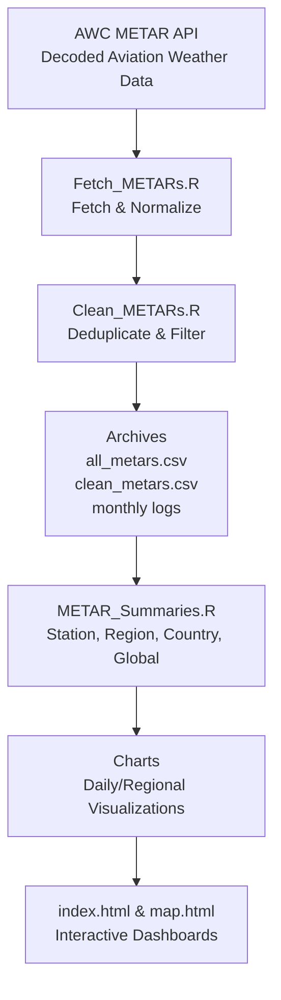

# ✈️ North America Flight Conditions Research Project (NAFCRP)  

---

## 🌍 Project Overview  

The **North America Flight Conditions Research Project (NAFCRP)** is a fully automated system for the **collection, cleaning, analysis, and visualization** of decoded **METAR aviation weather reports**.  

This project brings together **aviation safety, meteorology, climatology, and geospatial science** to produce one of the first open, reproducible, and binational climatologies of **flight conditions** across **Canada** and the **United States**.  

Every 5 minutes, the pipeline ingests METARs for a curated list of **~1000 representative airports** and transforms them into structured datasets, climatologies, and interactive dashboards.  

---

## 🛰️ Airport Network  

The monitoring network covers **~1000 airports**:  

- **~200 in Canada**  
- **~800 in the United States**  

The list was curated to maximize **geographic diversity, climatic coverage, and operational relevance**. It includes:  

- **Major international hubs** (e.g., JFK, ORD, LAX, YYZ, YVR)  
- **Regional connectors** (e.g., Boise, Charlottetown, Hamilton, Omaha)  
- **Remote and northern airports** critical for Arctic/Indigenous communities (e.g., Baker Lake, Rankin Inlet, Iqaluit)  
- **Mountain and coastal airports** with challenging weather (e.g., Aspen, Comox, Portland, Prince Rupert)  
- **Island/tropical airports** (e.g., Honolulu, Maui, San Juan)  

### 📍 Airport Metadata  

Each airport is georeferenced with:  
- **ICAO code**  
- **Airport name (site)**  
- **Province/State & Country**  
- **Latitude & Longitude**  

**Sources:**  
- [OurAirports Open Database](https://ourairports.com/data/)  
- [NOAA NCEI Integrated Surface Database (ISD)](https://www.ncei.noaa.gov/products/land-based-station/integrated-surface-database)  
- [Nav Canada](https://www.navcanada.ca/) & [FAA Aeronautical Data](https://nfdc.faa.gov/xwiki/bin/view/NFDC/21DayNASRSubscription)  

These metadata ensure each station can be mapped and linked to broader climatological and geographic datasets.  

---

## 🔄 Automated Data Pipeline  

The pipeline is powered by an **R-based workflow** that runs on **GitHub Actions every 5 minutes (UTC)**.  

### Workflow Diagram  

## 🔄 Workflow Steps  

- **Fetch** → Pull decoded METARs directly from the [NOAA Aviation Weather Center API](https://aviationweather.gov/data/api/).  
- **Clean** → Deduplicate reports, keep only meaningful updates (changes in `flight_category`, `temp_c`, `dewpoint_c`, `wind`, `visibility`, `altimeter`).  
- **Archive** → Maintain `all_metars.csv` (raw history), `clean_metars.csv` (processed), and rolling monthly logs.  
- **Analyze** → Compute % time in VFR/MVFR/IFR/LIFR:  
  - Per airport  
  - Per region (province/state)  
  - Per country (Canada, USA)  
  - Global aggregate  
- **Visualize** → Automatically generate charts and maps of airport- and region-level conditions.  
- **Dashboards** → Provide front-end views for quick exploration:  
  - `index.html` → Landing dashboard with summaries, charts, and airport explorer.  
  - `map.html` → Interactive geographic map of airports and conditions.  

---

## 📊 Research Contributions  

This dataset enables new lines of research and applications:  

- **Aviation Safety** – Quantify IFR/LIFR frequency for training, flight planning, and dispatch.  
- **Regional Climatologies** – Daily, seasonal, and annual patterns of flight restrictions across diverse environments.  
- **Comparative Analysis** – Contrast conditions between Arctic, Prairie, Mountain, Coastal, and Tropical airports.  
- **Fog & Ceiling Studies** – Identify hotspots for recurring low-visibility and ceiling events.  
- **Climate Change** – Assess long-term shifts in accessibility and weather-driven impacts to aviation.  
- **Policy Support** – Evidence for infrastructure planning, regulations, and resilience strategies.  

---

## 📅 Milestones & Roadmap  

| Timeline   | Deliverables                                                    |
|------------|-----------------------------------------------------------------|
| 2–3 months | Binational summaries (Canada vs USA) + anomaly mapping          |
| 6 months   | Seasonal climatologies (per province/state & region)            |
| 12 months  | Annual cycle climatology with cross-airport analysis            |
| Multi-year | Detection of climate-driven shifts & long-term aviation impacts |

---

## 🚀 Future Directions  

- **Unified dashboard** integrating maps, time-series, and summaries.  
- **Expanded datasets** → TAFs, PIREPs, radar, and satellite products.  
- **Machine Learning** → Forecasting flight categories and anomalies.  
- **Collaborations** → Partnerships with universities, agencies, and operators.  
- **Education** → Integration into aviation weather training tools.  

---

## 📌 Data & Sources  

- **METAR Reports** → [NOAA Aviation Weather Center (AWC) API](https://aviationweather.gov/data/api/)  
- **Airport Metadata** → [OurAirports](https://ourairports.com/data/), [FAA NASR](https://nfdc.faa.gov/), [Nav Canada](https://www.navcanada.ca/)  
- **Climatology Context** → [NOAA NCEI ISD](https://www.ncei.noaa.gov/products/land-based-station/integrated-surface-database)  

All data are open-access and redistributed under original licenses.  

---

## 🙌 Acknowledgements  

- **NOAA Aviation Weather Center** – for providing open access to METARs  
- **Nav Canada & FAA** – for airport metadata and regulatory datasets  
- **OurAirports Community** – for maintaining open geospatial data  
- **Rocker Project** – for containerized R environments used in CI/CD  

---

## 📌 Closing Note  

The **North America Flight Conditions Research Project** is designed as a **living climatology** — continuously updated, open, and reproducible.  

By automating the transformation of raw METAR reports into structured climatologies, the project creates value for:  

- **Pilots & operators** – awareness of high-risk IFR/LIFR-prone regions  
- **Researchers** – reproducible datasets for climatology, meteorology, and geography  
- **Policy & public** – insights into aviation weather risks and climate variability  

📈 This project will evolve into a comprehensive platform bridging **aviation, weather, and climate science**.  
