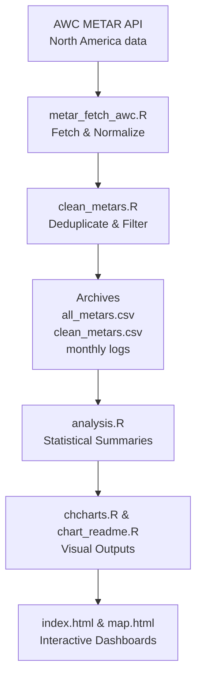

# North America Flight Conditions Research Project  

---

## 🌍 Overview  

The **North America Flight Conditions Research Project (NAFCRP)** automates the **collection, cleaning, analysis, and visualization of decoded METAR reports** for a curated network of **200 airports**:  

- **100 across Canada** (expanding on the original 50)  
- **100 across the United States**  

This pipeline establishes one of the first open, reproducible, and geographically comprehensive **binational climatologies of aviation flight conditions** in North America.  

The research connects **aviation safety, meteorology, geography, and climate science** by systematically monitoring:  

- **Flight categories**: VFR, MVFR, IFR, LIFR  
- **Meteorological variables**: temperature, dew point, humidity, wind, visibility, altimeter pressure, and cloud layers  
- **Temporal dynamics**: hourly, daily, seasonal, and multi-year trends  

The system runs fully automatically in the cloud, producing structured datasets and graphics that can be accessed for **research, operational, and policy applications**.  

---

## 🛰️ Airport Network  

The project monitors **200 airports** to represent the diverse operational and climatic environments of **Canada and the USA**.  

### 🇨🇦 Canada (100 airports)  

Includes all original 50 airports from Ontario, BC, Alberta, the Prairies, Quebec, Atlantic Canada, and the Arctic/North—plus an expanded set of 50 additional stations to strengthen coverage across regions such as:  
- Remote northern communities (e.g., Kugluktuk, Baker Lake, Rankin Inlet)  
- Key regional hubs (e.g., Kitchener, Hamilton, London, Charlottetown)  
- Coastal and mountainous airports (e.g., Prince Rupert, Nanaimo, Terrace, Comox)  
- Additional climate-diverse sites for long-term monitoring  

### 🇺🇸 United States (100 airports)  

Coverage spans the **Northeast, Mid-Atlantic, Southeast, Midwest, Texas & Plains, Rockies, Pacific Northwest, California, and Hawaii**. The selection includes:  
- Major international hubs (e.g., JFK, ORD, LAX, ATL, DFW)  
- Regional connectors (e.g., Boise, Spokane, Omaha, Tulsa, Charleston)  
- Coastal and mountainous airports (e.g., Aspen, Salt Lake City, Reno, Portland)  
- Key southern and island sites (e.g., Miami, San Juan, Honolulu, Maui)  

Together, the network allows for **comparative climatologies** of IFR/LIFR frequency across vastly different geographic and meteorological environments.  

---

## 🔄 Data Pipeline  

The system is powered by an **R-based workflow** executed on GitHub Actions every **5 minutes**, ensuring near–real-time updates.  

## 🔄 Workflow Steps  

- **Fetch METARs**: Download decoded reports for 200 airports.  
- **Clean & Deduplicate**: Keep only unique rows or meaningful changes (`flight_category`, `temp_c`, `dewpoint_c`, `wind`, `visibility`, `altimeter`).  
- **Archive**: Maintain master and monthly datasets (both raw and cleaned).  
- **Analyze**: Produce station-level and regional summaries, climatologies, and flight category breakdowns.  
- **Visualize**: Generate bar charts, time-series plots, and interactive dashboards.  
- **Front-End Views**:  
  - `index.html` – card-based dashboard for browsing METAR summaries.  
  - `map.html` – interactive geographic map with airport-level conditions.  

---

## 📊 Research Applications  

The expanded dataset opens new avenues for applied and academic research:  

- **Aviation Safety** – quantify IFR/LIFR frequency for pilot training, airline dispatch, and GA planning.  
- **Climatology** – develop daily, seasonal, and annual climatologies for North America’s most critical airports.  
- **Comparative Regional Studies** – contrast Arctic vs. Prairie vs. Coastal vs. Mountain vs. Tropical environments.  
- **Fog & Ceiling Research** – track hotspots for recurrent low-visibility or low-ceiling events.  
- **Climate Change Monitoring** – evaluate long-term shifts in weather-driven aviation accessibility.  
- **Policy Support** – inform infrastructure investment, safety guidelines, and adaptation strategies.  

---

## 📅 Research Milestones  

| Timeline   | Milestones & Deliverables                                    |
|------------|---------------------------------------------------------------|
| 2–3 months | Initial binational comparisons (Canada vs USA) & anomaly maps |
| 6 months   | Seasonal climatologies across provinces, states, and regions  |
| 12 months  | Annual cycle climatology with inter-airport analysis          |
| Multi-year | Detection of climate-driven shifts and aviation impacts       |  

---

## 🚀 Future Directions  

- **Unified dashboard** with real-time map + airport explorer  
- **Expanded datasets**: TAFs, PIREPs, radar, satellite  
- **Machine learning** forecasting of flight categories  
- **Collaborations** with universities and aviation authorities  
- **Integration** into aviation weather education and training tools  

---

## 📌 Closing Note  

This repository is designed as a **binational research platform for aviation climatology in North America**.  

By combining **automation, reproducibility, and transparency**, the project transforms raw METAR data into actionable knowledge for:  

- **Pilots & operators** – awareness of high-risk IFR/LIFR-prone regions.  
- **Researchers** – open data for climatology, meteorology, and geography.  
- **Public & policymakers** – evidence of aviation weather impacts and climate variability.  

All data, code, and dashboards are updated automatically, ensuring a **living dataset for science and society**.  
